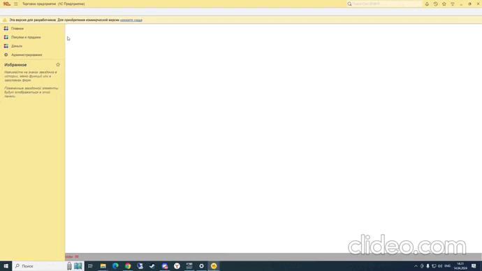

Доработка типовых конфигураций

-В документе выведено поле "Согласованная скидка".

-При расчете строки табличной части скидка учитывается.

-Реализована кнопка для пересчета табличной части, с учетом введенной скидки.

-Многократное нажатие на кнопку не приводит к уменьшению суммы.

[Сертификат](Sert.jpg)

С расширением

   

   

Внесением изменений на поддержке

   

   

