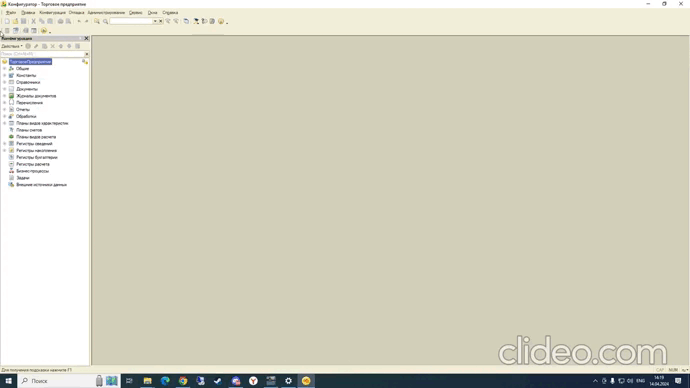

Доработка типовых конфигураций с [Раширением](demonstr-2.gif) ([Код](kod-2.gif)) и [Внесением изменений на поддержке](demonstr-1.gif) ([Код](kod-1.gif))

-В документе выведено поле "Согласованная скидка".

-При расчете строки табличной части скидка учитывается.

-Реализована кнопка для пересчета табличной части, с учетом введенной скидки.

-Многократное нажатие на кнопку не приводит к уменьшению суммы.

[Сертификат](Sert.jpg)

   

